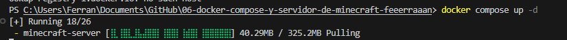
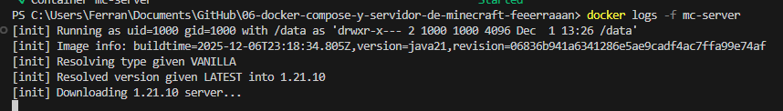
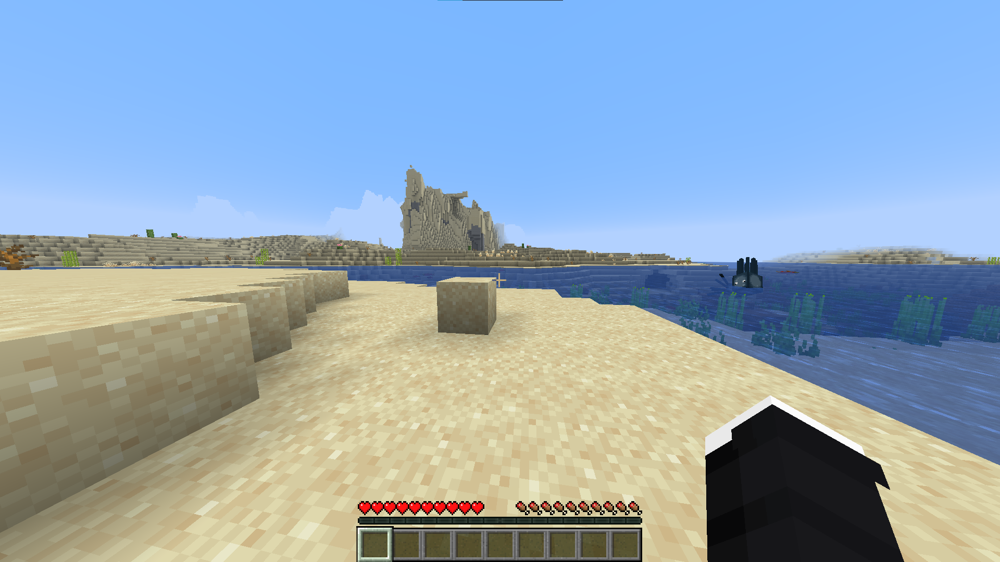
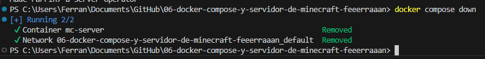
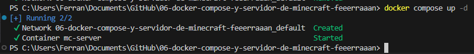
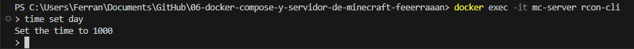

# **Despliegue de un Servidor de Minecraft (Java Edition) con Docker**

## **1. Introducción**

Este proyecto implementa el despliegue de un servidor de Minecraft utilizando **Docker Compose**. La configuración incluye:
- Automatización completa del despliegue mediante contenedores
- Persistencia de datos (mundos, configuraciones, inventarios)
- Limitación de recursos de hardware (RAM) para optimización
- Gestión de privilegios de administrador (OP)

Se utiliza la imagen oficial mantenida por la comunidad ([itzg/minecraft-server](https://hub.docker.com/r/itzg/minecraft-server)).

---

## **2. Requisitos Previos**

- **Docker Engine** instalado y en ejecución
- **Docker Compose** (incluido en Docker Desktop)
- Conexión a internet para descargar la imagen base
- Mínimo 2GB de RAM disponible para la máquina virtual Docker

---

## **3. Configuración del Servicio**

### **3.1. Archivo docker-compose.yml**

Se creó el archivo de configuración con los siguientes parámetros:

```yaml
services:
  minecraft-server:
    image: itzg/minecraft-server
    container_name: mc-server
    ports:
      - "25565:25565"
    environment:
      # Aceptación obligatoria del Acuerdo de Licencia de Usuario Final
      - EULA=TRUE
      # Límite de memoria asignada a la JVM (Java Virtual Machine)
      - MEMORY=2G
    volumes:
      # Persistencia de datos (mundos, configuraciones, inventarios)
      - mc-data:/data
    restart: unless-stopped

volumes:
  mc-data:
```

### **3.2. Desglose de Parámetros Técnicos**

| Parámetro | Descripción |
| :---- | :---- |
| **image** | Utiliza itzg/minecraft-server, automatiza instalación de Java y binarios del servidor |
| **container_name** | Nombre del contenedor para acceso mediante rcon-cli |
| **ports** | Mapea puerto 25565 del contenedor al host (protocolo de Minecraft) |
| **EULA=TRUE** | Variable crítica. Sin ella, el servidor abortaría el inicio |
| **MEMORY=2G** | Gestiona el *Heap Size* de Java, evita errores "Out of Memory" |
| **restart: unless-stopped** | Reinicia automáticamente si hay fallos |
| **volumes** | El volumen mc-data garantiza persistencia de datos entre reinicios |

---

## **4. Ejecución y Despliegue**

### **Paso 1: Iniciar el servidor**

Se ejecutó el comando en PowerShell:

```powershell
docker compose up -d
```

**Resultado:**



El parámetro `-d` inicia el contenedor en modo *detached* (segundo plano).

### **Paso 2: Verificación del Estado**

Para supervisar el proceso de inicialización y generación del mundo, se ejecutó:

```bash
docker logs -f mc-server
```

**Resultado - Servidor operativo:**



El servidor está operativo cuando aparece el mensaje: **Done (X.Xs)! For help, type "help"**

---

## **5. Acceso al Servidor de Minecraft**

### **Conectarse desde el Cliente de Minecraft**

Una vez que el servidor esté operativo (mensaje "Done"), se puede conectar:

1. Abrir Minecraft Java Edition
2. Ir a "Multijugador"
3. Agregar servidor con dirección: `localhost:25565`

**Resultado - Servidor accesible:**



---

## **6. Gestión de Permisos (Operador/Admin)**

Para otorgar permisos de administrador (OP) a un usuario, se utiliza rcon-cli:

```bash
docker exec mc-server rcon-cli op <NOMBRE_USUARIO>
```

Esto permite:
- Cambiar el modo de juego a creativo
- Teletransportarse
- Cambiar la hora del día
- Expulsar jugadores
- Ejecutar comandos administrativos

**Resultado - Usuario promovido a OP:**


El servidor confirma: **Made [NOMBRE_USUARIO] a server operator**

---

## **7. Ciclo de Vida y Mantenimiento**

### **Detener el servidor (Graceful shutdown)**

```bash
docker compose down
```



Esto detiene correctamente el contenedor sin perder datos (protegidos en el volumen).

### **Reiniciar el servidor**

```bash
docker compose up -d
```



Aplica cualquier cambio de configuración y reinicia el servicio.

### **Acceso interactivo a la consola del servidor (RCON)**

```bash
docker exec -it mc-server rcon-cli
```

Permite acceso directo a la consola del servidor para ejecutar comandos:



---

## **8. Conclusión**

Se ha desplegado exitosamente un servidor de Minecraft con Docker Compose, demostrando:
- ✅ Automatización de infraestructura mediante contenedores
- ✅ Persistencia de datos con volúmenes Docker
- ✅ Limitación de recursos (RAM)
- ✅ Acceso remoto y administrativo
- ✅ Gestión del ciclo de vida del servidor

El servidor está completamente operativo y listo para uso en red local.
